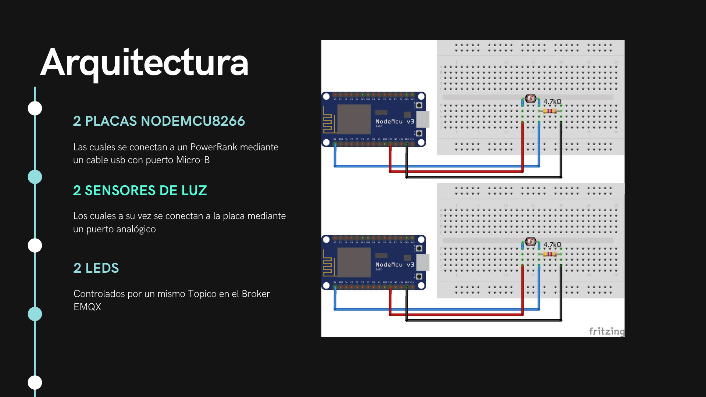
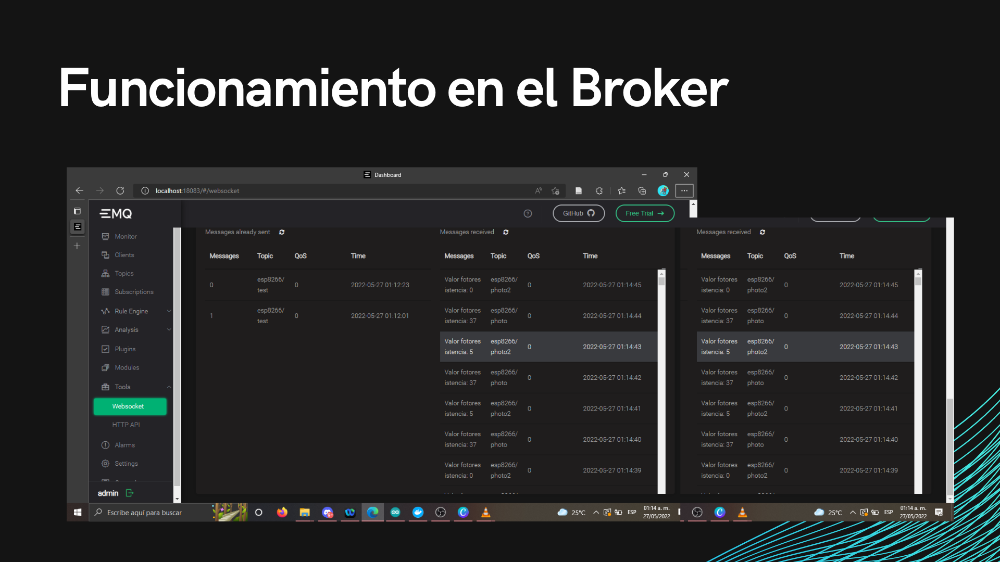

# 


En este apartado se muestra cómo se desarrolla el despliegue de la implementación del Proyecto del Internet de las cosas con un Sensor, el cuál conecta una placa NODEMCU8266 con un broker, utilizando las tecnologías de Docker, K8s, K3S, K3D y Rancher.
En la carpeta *IoT-NODEMCU8266-Sensor* se encuentran los archivos utilizados para el desarrollo, donde en el archivo 'Proyecto-IoT' se puede observar más información acerca del mismo.

## Autores
- **Victor Manuel Velasco Hernández**
- **Jeanette Murillo Cortes**

## Arquitectura del Proyecto 📐

En la siguiente imagen se muestra la arquitectura propuesta para que el sistema muestre el uso de los sensores y el led mediante el broker EMQX.



## Despliegue del Proyecto ⚙
El despliegue del proyecto se divide en dos:
*Placa NodeMCU8266
*Broker EMQX

### Instalaciones para el despliegue 🧩

Para el despliegue del proyecto se debe de tener como herramientas:
* Una placa NODEMUC8266
* Cable usb con puerto Micro-B
* 2 leds
* 2 fotoresistencias
* 1 resistencia
* Para observar mejor el funcionamiento del módulo de internet, se recomienda una PowerBank

Y previamente instalado:
* Arduino IDE
* Docker
Además de algunas otras las cuales se mencionan sus comandos de instalación en el documento 'Proyecto-IoT' como:
* Chocolatey
* K3S, K3D, Rancher

### Desarrollo del Despliegue

#### Placa NodeMCU8266 👨🏻‍💻
Una vez que instaladas y obtenidas las anteriores herramientas, primeramente se tiene que abrir el IDE de Arduino para cargar el archivo 'NODEMCU2'. En este caso, ArduinoIDLE solicitará hacer la creación de una carpeta, a lo cuál le daremos permiso. Una vez con el código dentro de Arduino, se debe de instalar la libreria que permite el uso de la placa NODEMCU8266, para lo cuál, se sugieren los siguientes pasos:

**1.** Primeramente ir al repositorio oficial del ESP8266: https://github.com/esp8266/arduino 

**2.** Ahi se encuentra el link oficial que le dice a Arduino qué descargar para el uso de NODEMCU8366:
https://arduino.esp8266.com/stable/package_esp8266com_index.json

**3.** En el IDE de Arduino, abrir **'Archivo>Preferencias'** y pegar el link en 'Gestor de URLs Adicionales de Tarjetas: '

**4.** Dar click en Ok

Ya con la libreria descargada, conectamos la NODEMCU8266 a uno de los puertos de nuestra máquina, conectando nuestra placa con el IDE de la siguiente forma:

**5.** Ir a **'Herramientas>Placa:Arduino/Genuino Uno>Gestor de tarjetas'**

**6.** En el campo de busqueda poner 'esp8266' y al encontrarlo, instalar dicha librería

**7.** Cerrar el Gestor de tarjetas y abrirlo nuevamente

**8.** Podemos observar ahora la placa NODEMCU8266, de manera que ahora se debe de dar click en 'Generic ESP8266 Module' (Es la 01) para seleccionarla
Pd. También existe la ESP8285 (Es la 12)

**9.** En herramientas checar los siguientes atributos:

   **Flash Size:** Se debe de observar si es 01 o 12, como se mencionó anteriormente
   
   **Upload Speed:** Es el nivel de carga del programa, esto depende del valor y carga del puerto y del usb
    
**10.** En caso de buscar más información para este proceso, orientarse mediante el siguiente url de Youtube, link video: https://www.youtube.com/watch?v=0g7sazWXfEI

De esta manera, una vez seleccionada la placa, procedemos a, dentro del código, poner nuestra red de internet a la cuál nos conectaremos, junto con su contraseña. Así, ya podemos compilar el programa para cargarlo a la placa, de esta forma, comenzará a buscar la señal del internet previamente configurado, y en la pantalla de salida del IDE, esperaremos hasta observar el mensaje de que 'Se ha conectado al internet'. 
El siguiente paso es opcional, el cuál consiste en decidir si dejar la placa conectada a la computadora o conectar la placa a un PowerBank (cuando se conecta a este último, se demuestra que la placa puede seguir utilizando el programa aún cuando ya no esta conectado a nuestro equipo, utilizando su modulo ESP8266 que contiene el dispositivo WiFi.

Las conexiones que fueron utilizadas de acuerdo a al diagrama de la arquitectura se muestran en la siguiente imagen:


Además, en el siguiente link se explica a mayor detalle cómo se realizó este apartado del proyecto además de la demostración del funcionamiento del mismo: https://drive.google.com/file/d/1ddA4rBIDVZXG3Wm8QdmoKxumuqb20x7B/view?usp=sharing


#### Broker EMQX 📦
Para poder implementar el Broker, es necesario instalar K3D y K3S, para poder comenzar con el cluster, para lo cuál se usaron los siguientes comandos(esta implementación fue en Windows por medio de PowerShell), recuerda que se debe tener instalado Chocolatey: 
```
CHOCO INSTALL K3D -Y
CHOCO INSTALL JQ -Y
CHOCO INSTALL YQ -Y
CHOCO INSTALL KUBERNETES-HELM -Y
```

Una vez instalado K3D, se usaran el siguiente comando para crear el clúster con Rancher, en el cuál se expondran los puertos que el despliegue requiera: 
```
K3D CLUSTER CREATE --API-PORT 6448 -P
"18083:18083" -P "1883:1883" -P "8883:8883" -P
"8081:8081" -P "8083:8083" -P "8084:8084" IOT
```

Para configurar, la variable de entorno del clúster, se introducirá el siguiente comando(exclusivo de PowerShell):
```
K3D KUBECONFIG GET IoT > $ENV:KUBECONFIG_FILE
$ENV:KUBECONFIG=($ENV:KUBECONFIG_FILE)
```
Después, al archivo YAML que se encuentra en este repositorio, lo aplicamos al clúster de K3S con el comando, para generar el Deployment y el Service:
```
K3S KUBECTL APPLY -F EMQX.YAML
```

Es importante recordar que los puertos **18083, 1883, 8883, 8081, 8083, 8084** serán utilizados.
Tras esto, procederemos a generar los NodePorts del proyecto, aplicando el siguiente comando a todos los puertos:
```
KUBECTL EXPOSE DEPLOYMENT EMQX-DEPLOYMENT --NAME EMQX-DASHBOARD --PORT=<port> --TARGET-PORT=<same port> --TYPE NODEPORT
```

Y con esto, le aplicamos el Port-forward para vincular a nuestra PC los puertos a utilizar, con el comando:
```
KUBECTL PORT-FORWARD EMQX-DASHBOARD <port>:<same port>

```
## Uso del Broker EMQX
Accedemos a nuestro Broker por medio del localhost del equipo en el que se encuentre instalado, en el socket **18083**, e iniciamos sesión con un usuario default:
  **Usuario:** admin
  
  **Password:** public

Suponiendo que las placas NodeMCU8266 están ya conectadas y registradas como clientes dentro del broker, en la barra lateral izquierda del Dashboard, accedemos a **"Tools>Websocket"**, en este apartado generaremos un clientID, en el cuál, le asignaremos nombre y pondremos los datos del usuario con el que se acceso, a continuación un ejemplo:
```
   1. Name: ESP8266
   2. Client ID: esp8266-client
   3. Username: admin
   4. Password: public
```
Se dara click en el botón 'Connect' y observar que la placa marque como Connected.

Tras haber creado el usuario, se procede a generar una suscripción en el tópico **"esp8266/photo"** y **"esp8266/photo2"**, y por ultimo se emitirá un mensaje **"1"** para prender los led, al tópico **"esp8266/test"**, a continuación un ejemplo:
```
   1. Topic: esp8266/test
   2. Messages: 1 (para encender) o 0 (para apagar)
   3. Dar click en botón para enviar y vemos si se envió el mensaje
```
De esta manera, si el mensaje ha sido enviado correctamente, el led de la placa NODEMCU8266 prenderá o se apagará, según reciba el mensaje.

En el broker, se mostrará la información que se obtiene de los resultados del sensor:


