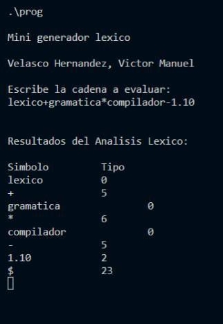

### Mini Análizador Léxico

Programa funcionando correctamente al introducir identificadores y números reales.
Esto funciona primeramente leyendo una cadena de manera que la va dividiendo por tokens, siendo al final donde se imprime el resultado del análisis. Como sabemos, la implementación del analizador léxico es la base de todo compilador. 
Es por esto que el mini analizador léxico es una introducción al análizis completo de cada token, por lo que en esta etapa dicho análisis es para los identificadores, números y números reales, como se muestra en la siguiente imagen: 

Como se muestra, su misión de reconocer los componentes léxicos o tokens, es correcta.

