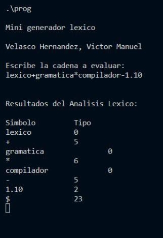
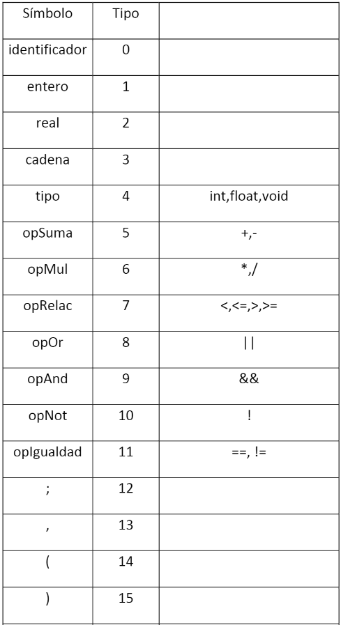
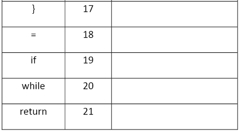
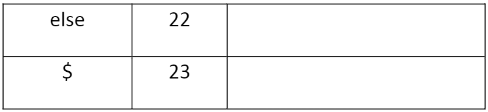
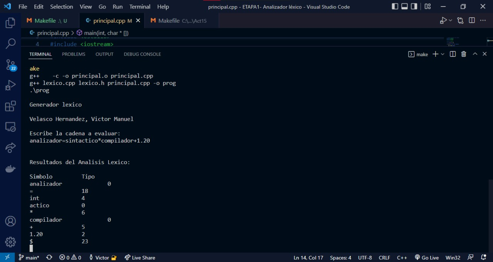
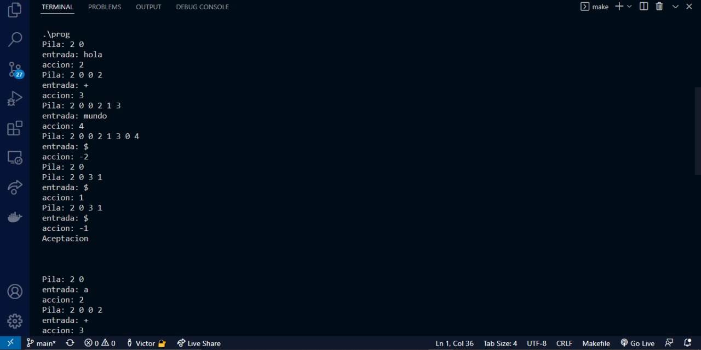
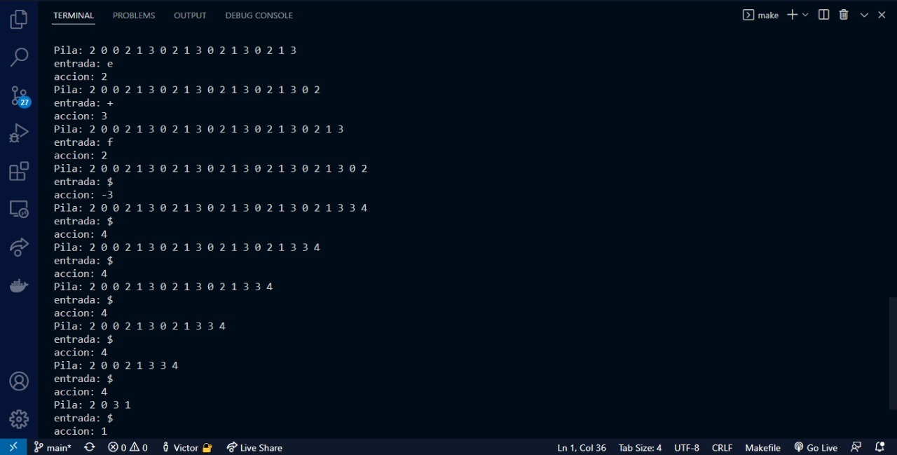

# SeminarioTraductoresII-D02
Portafolio de Evidencias de Victor Manuel Velasco Hernández
Código: 265988791

### Mini Análizador Léxico

La implementación del analizador léxico es la base de todo compilador. Es por esto que el mini analizador léxico es una introducción al análizis completo de cada token, por lo que el programa realiza un análizis en base a una cadena, la cuál va a determinar si hay identificadores, números o números reales en ella. Esto funciona mediante el análisis de cada token que se recibe, por lo que al final se muestra el resultado de clasificación de los tokens, como se muestra en la siguiente imagen:

### Análizador Léxico

Acorde a las instrucciones de la siguiente tabla, se realizó la implementación de esta etapa donde se agregaron más condiciones para el reconocimiento de más tokens.

El propósito fue agrupar el texto en los diferentes tipos de patrones que conforman las unidades léxicas como identificadores (de variables, de funciones, de procedimientos, de tipos, de clases), palabras reservadas y operadores.
En la siguiente imagen se puede ver el análizis de dicho código fuente.

Su misión de reconocer los componentes léxicos o tokens, es correcta.

### Mini Análizador Sintáctico

En la tercera etapa se realizó un mini analizador sintáctico el cuál mediante el uso de la tabla LR, consiste en el uso de las reglas que permiten identificar la estructura de ciertas instrucciones, así como si son correctas o no.

En esta etapa utilizó una pila de objetos enteros, donde se analizan los ejercicios propuestos con las cadenas de 'hola+mundo' y 'a+b+c+d+e+f'. Cada que se avanza el token, como en el ejercicio de excel, se va determinando el estado de la siguiente regla de la gramática a utilizar hasta que se realicen las reducciones para observar si la práctica se ha realizado correctamente, como se observa desde las imagenes anteriores.

### Mini Análizador Sintáctico (Objetos)

