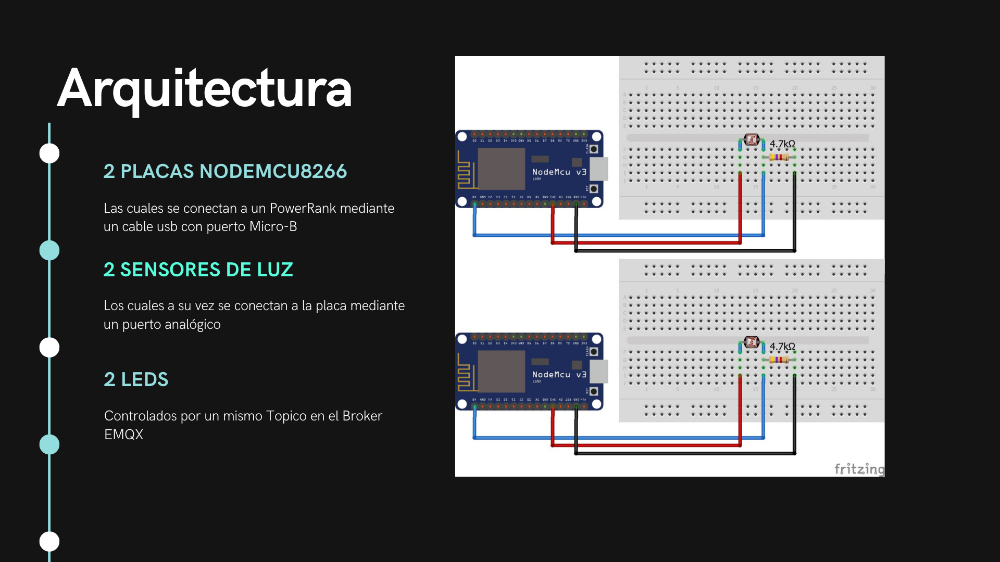
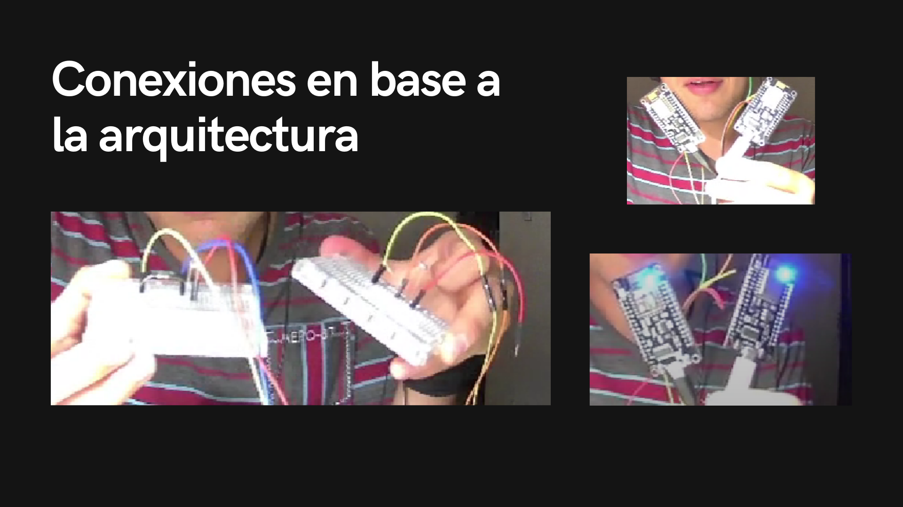

# SeminarioTraductoresII-D02
Portafolio de Evidencias de **Victor Manuel Velasco Hernández**
- Código: 265988791

### Mini Análizador Léxico

La implementación del analizador léxico es la base de todo compilador. Es por esto que el mini analizador léxico es una introducción al análizis completo de cada token, por lo que el programa realiza un análizis en base a una cadena, la cuál va a determinar si hay identificadores, números o números reales en ella. Esto funciona mediante el análisis de cada token que se recibe, por lo que al final se muestra el resultado de clasificación de los tokens, como se muestra en la siguiente imagen:

### Análizador Léxico

Acorde a las instrucciones de la siguiente tabla, se realizó la implementación de esta etapa donde se agregaron más condiciones para el reconocimiento de más tokens.

El propósito fue agrupar el texto en los diferentes tipos de patrones que conforman las unidades léxicas como identificadores (de variables, de funciones, de procedimientos, de tipos, de clases), palabras reservadas y operadores.
En la siguiente imagen se puede ver el análizis de dicho código fuente.

Su misión de reconocer los componentes léxicos o tokens, es correcta.

### Mini Análizador Sintáctico

En la tercera etapa se realizó un mini analizador sintáctico el cuál mediante el uso de la tabla LR, consiste en el uso de las reglas que permiten identificar la estructura de ciertas instrucciones, así como si son correctas o no.

En esta etapa utilizó una pila de objetos enteros, donde se analizan los ejercicios propuestos con las cadenas de 'hola+mundo' y 'a+b+c+d+e+f'. Cada que se avanza el token, como en el ejercicio de excel, se va determinando el estado de la siguiente regla de la gramática a utilizar hasta que se realicen las reducciones para observar si la práctica se ha realizado correctamente, como se observa desde las imagenes anteriores.

### Mini Análizador Sintáctico (Objetos)

En esta cuarta etapa se realiza un cambio que permite identificar los tokens mediante una pila de objetos, reemplazando a la pila de enteros que se tenia anteriormente, añadiendo además una clase ElementoPila, de la cuál heredan atributos las clases 'Estado', 'Terminal' y 'No Terminal'.

Podemos observar cómo se realiza el análisis de la sintáctica de la candena, mostrando su correcto funcionamiento para el análisis de los ejercicios 1 y 2 hasta llegar a su aceptación.

### Análizador Sintáctico Gramática

# Proyecto IoT NODEMCU8266 Sensor

En este apartado se muestra cómo se desarrolla el despliegue de la implementación del Proyecto del Internet son un Sensor, el cuál conecta una placa NODEMCU8266 con un broker, utilizando las tecnologías de Docker, K8s, K3S, K3D y Rancher.
En la carpeta *IoT-NODEMCU8266-Sensor* se encuentran los archivos utilizados para el desarrollo, donde en el archivo 'Proyecto-IoT' se puede observar más información acerca del mismo.

## Arquitectura del Proyecto

En la siguiente imagen se muestra la arquitectura propuesta para que el sistema muestre el uso de los sensores y el led mediante el broker EMQX.

## Despliegue del Proyecto

### Instalaciones para el despliegue

Para el despliegue del proyecto se debe de tener como herramientas:
* Una placa NODEMUC8266
* Cable usb con puerto Micro-B
* 2 leds
* 2 fotoresistencias
* 1 resistencia
* Para observar mejor el funcionamiento del módulo de internet, se recomienda una PowerRank

Y previamente instalado:
* Arduino IDE
* Docker
Además de algunas otras las cuales se mencionan sus comandos de instalación en el documento 'Proyecto-IoT' como:
* Chocolatey
* K3S, K3D, Rancher

### Desarrollo del Despliegue

Una vez que instaladas y obtenidas las anteriores herramientas, primeramente se tiene que abrir el IDE de Arduino para cargar el archivo 'NODEMCU2'. En este caso, arduino solicitará hacer la creación de una carpeta, a lo cuál le daremos permiso. Una vez con el código dentro de Arduino, se debe de instalar la libreria que permite el uso de la placa NODEMCU8366, para lo cuál, se sugieren los siguientes pasos:

1. Primeramente ir al repositorio oficial del ESP8266: https://github.com/esp8266/arduino 
2. Ahi se encuentra el link oficial que le dice a Arduino qué descargar para el uso de NODEMCU8366: https://arduino.esp8266.com/stable/package_esp8266com_index.json
3. En el IDE de Arduino, abrir 'Archivo>Preferencias' y pegar el link en 'Gestor de URLs Adicionales de Tarjetas: '
4. Dar click en Ok

Ya con la libreria descargada, conectamos la NODEMCU8266 a uno de los puertos de nuestra máquina, conectando nuestra placa con el IDE de la siguiente forma:
5. Ir a 'Herramientas>Placa:Arduino/Genuino Uno>Gestor de tarjetas'
6. En el campo de busqueda poner 'esp8266' y al encontrarlo, instalar dicha librería
7. Cerrar el Gestor de tarjetas y abrirlo nuevamente
8. Podemos observar ahora la placa NODEMCU8266, de manera que ahora se debe de dar click en 'Generic ESP8266 Module' (Es la 01) para seleccionarla
Pd. También existe la ESP8285 (Es la 12)
9. En herramientas checar los siguientes atributos:
   Flash Size: Se debe de observar si es 01 o 12, como se mencionó anteriormente
    Upload Speed: Es el nivel de carga del programa, esto depende del valor y carga del puerto y del usb
10. En caso de no poder, orientarse mediante el siguiente url de Youtube, link video: https://www.youtube.com/watch?v=0g7sazWXfEI

De esta manera, una vez seleccionada la placa, procedemos a, dentro del código, poner nuestra red de internet a la cuál nos conectaremos, junto con su contraseña. Así, ya podemos compilar el programa para cargarlo a la placa, de esta forma, comenzará a buscar la señal del internet previamente configurado, y en la pantalla de salida del IDE, esperaremos hasta observar el mensaje de que 'Se ha conectado al internet'. 
El siguiente paso es opcional, el cuál consiste en decidir si dejar la placa conectada a la computadora o conectar la placa a un PowerRank (cuando se conecta a este último, se demuestra que la placa puede seguir utilizando el programa aún cuando ya no esta conectado a nuestro equipo, utilizando su modulo ESP8266 que contiene el dispositivo WiFi.

Las conexiones que fueron utilizadas de acuerdo a al diagrama de la arquitectura se muestran en la siguiente imagen:

Además, n el siguiente link se explica a mayor detalle cómo se realizó este apartado del proyecto además de la demostración del funcionamiento del mismo: https://drive.google.com/file/d/1ddA4rBIDVZXG3Wm8QdmoKxumuqb20x7B/view?usp=sharing

Después, el siguiente paso es dirigirnos al Broker EMQX de la siguiente manera:

1. Entrar a la página emqx.com/en
2. Dirigirse al apartado gratis y publico, con este link:
https://www.emqx.com/en/mqtt/public-mqtt5-broker o buscar la opción 'Publick mqtt5 broker'
3. Ir y dar click al botón de 'Learn more...' en el apartado de Online MQTT Client
4. Dar click en el botón de 'Visit MQTT WebSocket Toolkit'
5. Click en New conection
6. Crear un client

7. En el apartado de 'Tools' dar click en 'Websocket' y hacer las siguientes configuraciones:
   1. Name: ESP8266
   2. Client ID: esp8266-client
   3. Username: admin
   4. Password: public
8. Dar click en el botón 'Connect' y observar que la placa marque como Connected

9. Por último, en 'Messsages', configurar:
   1. Topic: esp8266/test
   2. Messages: 1 (para encender) o 0 (para apagar)
   3. Dar click en botón para enviar y vemos si se envió el mensaje

De esta manera, si el mensaje ha sido enviado correctamente, el led de la placa NODEMCU8266 prenderá o se apagará, según reciba el mensaje.

En el broker, se mostrará la información que se obtiene de los resultados del sensor:

