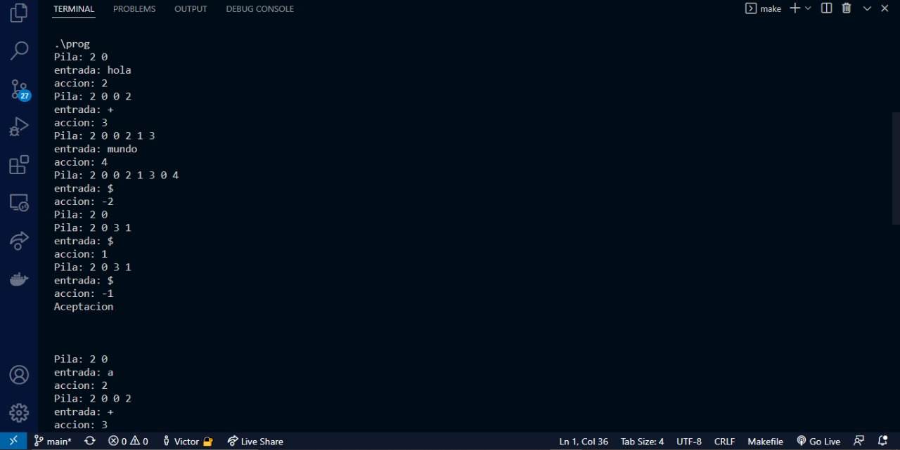
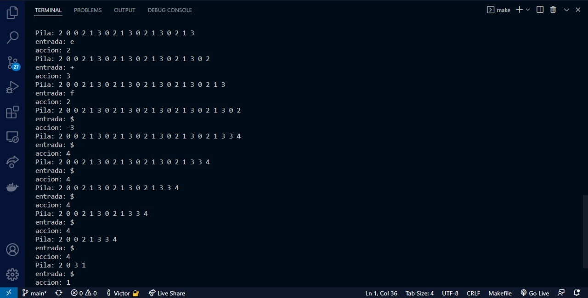

## Mini Análizador Sintáctico Objetos

En esta cuarta etapa se realiza un cambio que permite identificar los tokens mediante una pila de objetos, reemplazando a la pila de enteros que se tenia anteriormente.
Primero se añadió una clase ElementoPila, de la cuál heredan atributos las clases 'Estado', 'Terminal' y 'No Terminal'.

Podemos observar cómo se realiza el análisis de la sintáctica de la candena, mostrando su correcto funcionamiento para el análisis de los ejercicios 1 y 2 hasta llegar a su aceptación.

